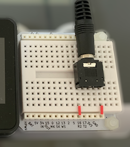

# エアロバイク連動位置情報シミュレーター

市販のエアロバイクとiOS端末の位置情報を連動させるためのアプリ一式です。

以下の機材とアプリから構成されています。

* エアロバイク用 回転数取得機材 (M5Stack製)
* エアロバイク用 回転数送信用アプリ
* Mac用 回転数受信/位置情報変更用アプリ

エアロバイクにM5Stackで作成した簡易的な機材を接続して回転数をBluetoothで送信します。
Mac用アプリではBluetooth経由で取得した回転数を元にiOS端末の位置情報を更新します。

iOS端末の位置情報変更には[libimobiledevice](https://github.com/libimobiledevice/libimobiledevice)を使用しており、脱獄や追加アプリのインストールせずに位置情報を変更することができます。

### :warning: 注意事項

- このアプリは電気信号等を制御するため、使用機材に予期せぬ損害を与える可能性があります。
  もしも損害が発生した場合、エアロバイクの通常の使用方法とは異なるためメーカー保証の対象外となります。

- iOS端末の位置情報変更はアプリ開発や試験のために提供されている機能です。
  位置情報を変更した状態で市販のアプリ等を実行した場合は運営者により不正行為とみなされる可能性があります。

- 記載されている機材等は開発時に使用したものを記載してあります。それらの機材での動作を保証するものではありません。

- これらのリスクを十分にご理解頂いた上で、自己責任においてご利用ください。

## 構成図


## エアロバイク用機材の作成

### 使用機材

* [アルインコ コンフォートバイクⅡ](https://www.alinco.co.jp/product/fitness/detail/id=4175)
* [M5Stack Basic](https://www.switch-science.com/catalog/3647/)
* [SideBB for M5Stack(ブレッドボード)](https://www.switch-science.com/catalog/4098/)
* [3.5mm オーディオジャック](https://www.switch-science.com/catalog/619/)
* [ジャンパワイヤ](https://www.switch-science.com/catalog/314/)

### 作成手順

1. M5Stackのボトムを外し、代わりにSideBBを接続します
2. SideBBに回線図を参考にオーディオジャック、ジャンパワイヤを接続します
3. Arudiono IDEなどを使用して、M5Stackに[IndoorBike.ino](IndoorBike/IndoorBike.ino)をインストールします

    |  回路図 |
    | :-------------: |
    |   |
    | オーディオジャックの左右のピンとGND、5番を接続します  |

### 設置手順

1. エアロバイク備え付けのモニターに接続されているオーディオケーブルを外します。
2. 外したケーブルを、作成したメーターのオーディオジャックに接続します。ケーブルは背面にあり長さも限られています。必要に応じてオーディオケーブル用の延長ケーブルや分配器をご利用ください。

    |  オーディオケーブル位置 |
    | :-------------: |
    |   |

    |  接続例 |
    | :-------------: |
    |   |


## Mac用アプリの作成

### 要求環境

- macOS 10.15
- Xcode 11.5
- Swift 5.0
- iOS 13.5 (端末)

### 依存ライブラリのインストール

以下のライブラリをそれぞれgithubから取得し、ソースコードからコンパイル、インストールします。

- [libplist](https://github.com/libimobiledevice/libplist)
- [libusbmuxd](libusbmuxd)
- [libimobiledevice](https://github.com/libimobiledevice/libimobiledevice)
- [idevicelocation](https://github.com/JonGabilondoAngulo/idevicelocation)

```
./autogen.sh
make
sudo make install
```

コンパイル時にopensslが見つからない場合は以下のコマンドを試してください

```
export PATH=/usr/local/opt/openssl/bin:$PATH
export LD_LIBRARY_PATH=/usr/local/opt/openssl/lib:$LD_LIBRARY_PATH
export CPATH=/usr/local/opt/openssl/include:$CPATH
export LIBRARY_PATH=/usr/local/opt/openssl/lib:$LIBRARY_PATH
export PKG_CONFIG_PATH=/usr/local/opt/openssl/lib/pkgconfig
```

homebrew経由でもインストール可能ですが、手元の環境では正常に動作しませんでした。
そのため、ソースコードからインストールすることをお勧めします。

### ビルド&実行手順

1. Xcodeで[VirtualCycling.xcodeproj](Mac/VirtualCycling.xcodeproj)を開きます。
2. Signing & Capabilitiesで自身のデベロッパーアカウントを指定します
3. Runボタンを押してアプリを実行します。

    |  署名設定 |
    | :-------------: |
    |   |
    | Teamにデベロッパーアカウントを指定します |

## 使用方法

1. MacにiOS端末を接続して、Mac用アプリのStartボタンを押します。
2. 地図上の任意の位置を長押しして、現在地を設定します。
3. iOS端末でマップを開くと、現在位置がMac用アプリで指定した座標に変更されていることが確認できます。
4. エアロバイクを使用すると、回転に連動してiOS端末の現在位置が移動します。

    |  起動 |
    | :-------------: |
    |   |
    | iOS端末をMacに接続しStartを押します |

    |  座標指定 |
    | :-------------: |
    |  |
    | 地図上で長押しすると現在位置に指定されます |

**方向を変える**

- M5StackのA/Cボタンで移動方向が東/西方向に変わります。

**終了する**

- Mac用アプリ右上にあるResetボタンを押します。


## 作成者

Watanabe Toshinori – toshinori_watanabe@tiny.blue


## ライセンス

このプロジェクトはMITライセンスです。詳細は [ライセンス](LICENSE) ファイルを参照してください。


## 謝辞

このアプリでは以下のライブラリを使用しています。

* [libimobiledevice](https://github.com/libimobiledevice/libimobiledevice)
* [idevicelocation](https://github.com/JonGabilondoAngulo/idevicelocation)


このアプリを作成するにあたり、以下の記事を参照しました。

* [Aerocraft](https://github.com/mizucoffee/Aerocraft)
* [【フィットネスバイク】のインターネットを作る！！:Qiita](https://qiita.com/ie4/items/130308793444bd98179f)
* [M5Stack Bluetooth LE通信テスト](https://github.com/FromF/M5Stack-Color-BluetoothLE)
